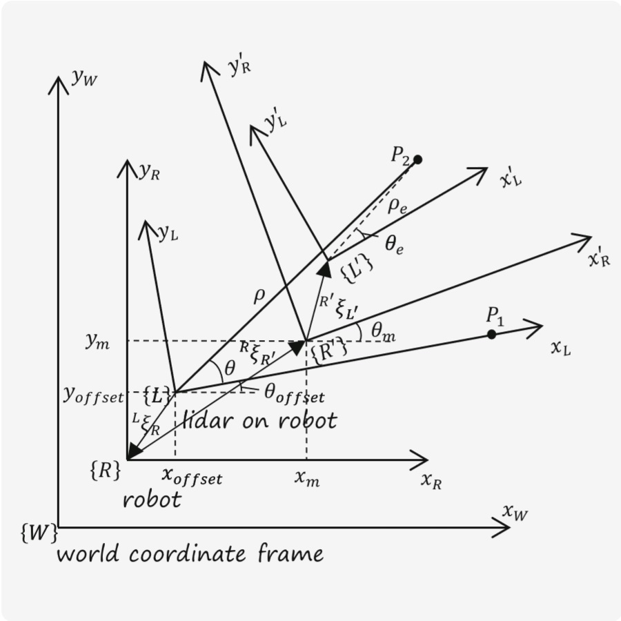
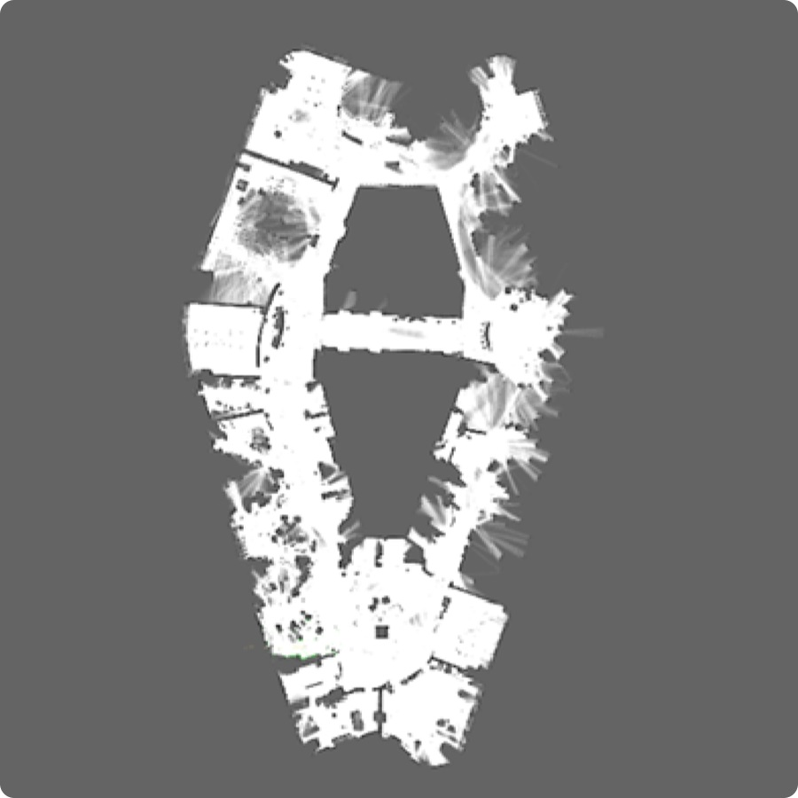
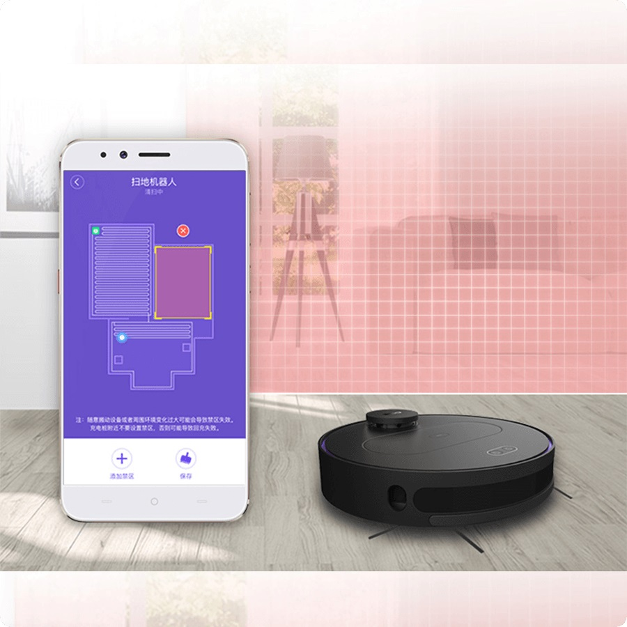
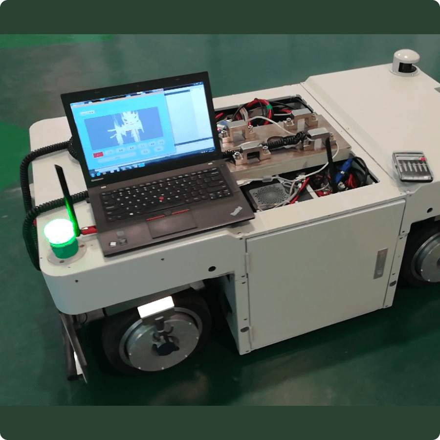
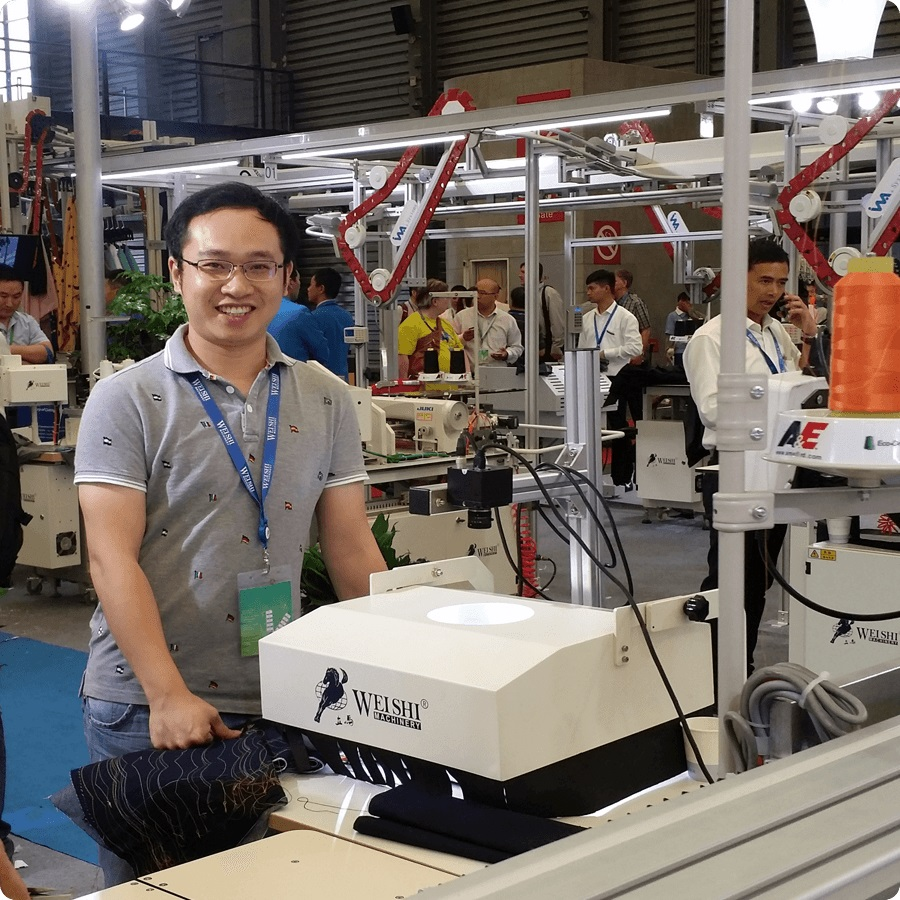
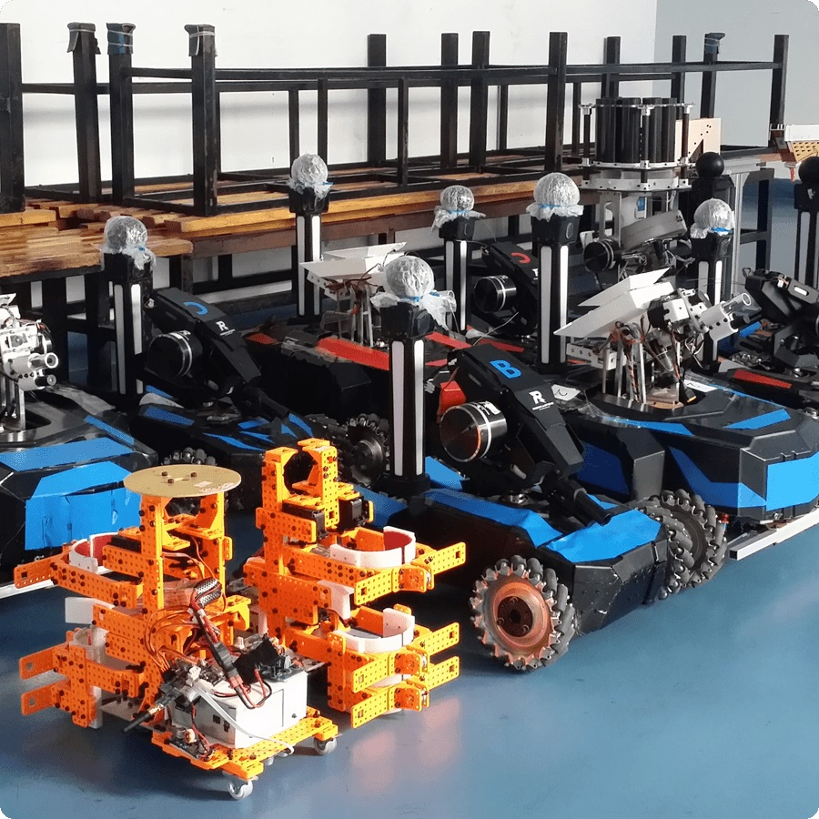
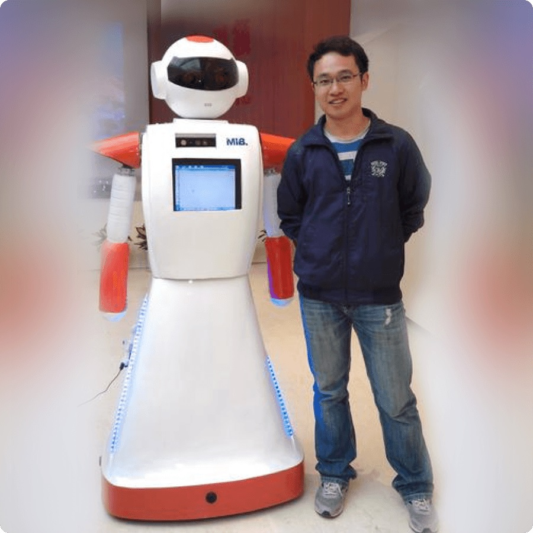

## Bio
----------

I am a SLAM algorithm engineer in Shenzhen, China, who already has 4 years of work experience at LDROBOT and BAIDU in succession, from 2017, in the Autonomous Mobile Robots field, especially in SLAM research. Prior to this, I received my B.Eng. in Mechanical Design, Manufacturing and Automation and M.Eng. in Mechatronics Engineering in 2014 and 2017, respectively, both from the Huazhong University of Science and Technology (HUST) in China.
  

My research interests are in the areas of autonomous mobile robots, which includes autonomous vehicles, unmanned aerial vehicles and service robots, with focus on sensor fusion, localization and mapping, and state estimation in real environments.
  

In this page, you may know more about me.

<b>CV:</b> [CV](./assets/pdf/CV.pdf)  
<b>Link:</b> [GitHub](https://github.com/wenzhibai)  
<b>Email:</b> [tank.wenzhi.bai@gmail.com](mailto:tank.wenzhi.bai@gmail.com)  

 

## Skills
----------
<b>Programming Languages:</b> C/C++ (very strong), Python (fair), Shell (fair)  
<b>Algorithm Libraries:</b> OpenCV, Eigen, Ceres Solver, OpenGL, PCL  
<b>Tools:</b> Linux/Ubuntu, ROS, Git, CMake  

 

## Honors
----------
<html>
    <table border="0" rules="none">
        <tr>
            <td style="vertical-align:top; text-align:left">
            The Excellent Postgraduate Graduate
            </td>
            <td width="70" style="vertical-align:top; text-align:right">May 2017</td>
        </tr>
        <tr>
            <td style="vertical-align:top; text-align:left">
            The Merits Postgraduate Student <b>(Top 5%)</b> 
            The National Scholarship for Postgraduates <b>(Top 2%, 20,000 RMB)</b>
            </td>
            <td style="vertical-align:top; text-align:right">Dec. 2015</td>
        </tr>
        <tr>
            <td style="vertical-align:top; text-align:left">
            The Excellent Graduate
            </td>
            <td style="vertical-align:top; text-align:right">Jun. 2014</td>
        </tr>
        <tr>
            <td style="vertical-align:top; text-align:left">
            The Merits Student <b>(Top 5%)</b> 
            The National Scholarship <b>(Top 2%, 8,000 RMB)</b>
            </td>
            <td style="vertical-align:top; text-align:right">Dec. 2013</td>
        </tr>
        <tr>
            <td style="vertical-align:top; text-align:left">
            The Outstanding Individual in the Undergraduate Innovation Activities  <b>(TOP 10%)</b> 
            </td>
            <td style="vertical-align:top; text-align:right">Dec. 2012</td>
        </tr>
    </table>
</html>

 

## Awards
----------
<html>
    <table border="0"  rules="none">
        <tr>
            <td style="vertical-align:top; text-align:left">
            <b>The First Place</b> of Central China Division and <b>the National Second Place</b> in the RoboMaster of 14th National Undergraduate Robot Competition
            </td>
            <td width="70" style="vertical-align:top; text-align:right">Aug. 2015</td>
        </tr>
        <tr>
            <td style="vertical-align:top; text-align:left">
            <b>The First Place</b> in the National Undergraduate Electronic Design Competition (Subject: The Control System of Unmanned Aerial Vehicles), Hubei Division
            </td>
            <td style="vertical-align:top; text-align:right">Nov. 2013</td>
        </tr>
        <tr>
            <td style="vertical-align:top; text-align:left">
            <b>The First Place</b> in the National Undergraduate Mechanical Products Digital Design Competition
            </td>
            <td style="vertical-align:top; text-align:right">May 2013</td>
        </tr>
        <tr>
            <td style="vertical-align:top; text-align:left">
            <b>The First Place</b> in the 5th National Undergraduate Mechanical Innovation Design Competition, Hubei Sectional Preliminaries
            </td>
            <td style="vertical-align:top; text-align:right">May 2012</td>
        </tr>
    </table>
</html>

 

## Publications
----------
<html>
    <table border="0" rules="none">
        <tr>
            <td width="30%" style="vertical-align:top; text-align:left">
            
            </td>
            <td width="70%" height="150" style="vertical-align:top; text-align:left">
                

                <strong>Correction Algorithm of LIDAR Data for Mobile Robots</strong>  
                <b>Wenzhi Bai</b>, Gen Li and Liya Han 
                <i>International Conference on Intelligent Robotics and Applications 2017 (ICIRA 2017)</i> 
                <a href="./assets/pdf/ICIRA2017.pdf"> [pdf]</a>
                

            </td>
        </tr>
        <tr>
            <td width="30%" style="vertical-align:top; text-align:left">
            
            </td>
            <td width="70%" height="150" style="vertical-align:top; text-align:left">
                

                <strong>Study on Lidar-based Map-building for Service Robots</strong>  
                <b>Wenzhi Bai</b> 
                <i>Huazhong University of Science and Technology. MA thesis. 2017</i> 
                <a href="./assets/pdf/MA_Thesis.pdf"> [pdf]</a>
                

            </td>
        </tr>
    </table>
</html>

 

## Projects
----------
<html>
    <table border="0" rules="none">
        <tr>
            <td width="30%" style="vertical-align:top; text-align:left">
            
            </td>
            <td width="70%" height="150" style="vertical-align:top; text-align:left">
                

                <strong>AVP (Autonomous Valet Parking)</strong> 
                Sept. 2019 - Apr. 2020 
                Senior Algorithm Engineer, <a href="https://apollo.auto"> BAIDU APOLLO</a> 
                <b>HIGHLIGHTS: </b> 
                ● Realized the vehicle dynamic relocalization and initialization through getting the optimal solution by RANSAC plus Global Bundle Adjustment 
                ● Constructed a set of automatic testing and recording module 
                ● Built a sensor data repository based on Ring Buffer 
                ● Realized the online automatic calibration module of camera external parameters
                

            </td>
        </tr>
        <tr>
            <td width="30%" style="vertical-align:top; text-align:left">
            
            </td>
            <td width="70%" height="150" style="vertical-align:top; text-align:left">
                

                <strong>APA (Automatic Parking Assist)</strong>  
                Nov. 2018 - Sept. 2019 
                Senior Algorithm Engineer, <a href="https://apollo.auto"> BAIDU APOLLO</a> 
                <b>HIGHLIGHTS: </b> 
                ● Constructed the Occupancy Grid Map by Ultrasonic Radars 
                ● Applied the Kalman Filter to estimate parking spaces
                

            </td>
        </tr>
        <tr>
            <td width="30%" style="vertical-align:top; text-align:left">
            
            </td>
            <td width="70%" height="150" style="vertical-align:top; text-align:left">
                

                <strong>Lidar-based Vacuum Cleaning Robot</strong> 
                Jul. 2017 - Nov. 2018 
                Algorithm Engineer/Pre-research Project Team Leader, <a href="https://www.ldrobot.com/en"> LDROBOT</a> 
                <b>HIGHLIGHTS: </b> 
                ● Developed and optimized the Lidar-based SLAM module 
                ● Constructed the SLAM automatic test system 
                ● Preliminary study of contactless visual obstacle avoidance based on depth camera 
                ● Shipped more than 100,000 units by the time of my departure
                

            </td>
        </tr>
        <tr>
            <td width="30%" style="vertical-align:top; text-align:left">
            
            </td>
            <td width="70%" height="150" style="vertical-align:top; text-align:left">
                

                <strong>Autonomous Mobile Platform Control System</strong> 
                Mar. 2016 - Jun. 2017 
                Lidar-based SLAM Algorithm Design 
                <b>HIGHLIGHTS: </b> 
                ● Developed the Lidar-based SLAM module by transfering <a href="https://github.com/cartographer-project/cartographer"> Cartographer</a> 
                ● ICIRA2017, EI paper: <i>Correction Algorithm of LIDAR Data for Mobile Robots</i><a href="./assets/pdf/ICIRA2017.pdf"> [pdf]</a>
                

            </td>
        </tr>
        <tr>
            <td width="30%" style="vertical-align:top; text-align:left">
            
            </td>
            <td width="70%" height="150" style="vertical-align:top; text-align:left">
                

                <strong>CNC Sewing Equipment CAD/CAM Software</strong> 
                Oct. 2013 - Dec. 2015 
                Software Development/Team Leader 
                <b>HIGHLIGHTS: </b> 
                ● Funded by HUST Graduate Base of Innovation and Entrepreneurship and finished the project with "Excellent" results 
                ● Exhibited in <a href="https://en.cisma.com.cn"> CISMA</a> (China International Sewing Machinery & Accessories Show)
                

            </td>
        </tr>
        <tr>
            <td width="30%" style="vertical-align:top; text-align:left">
            
            </td>
            <td width="70%" height="150" style="vertical-align:top; text-align:left">
                

                <strong>HUST RoboMaster STAR Club</strong> 
                Sept. 2014 - Oct. 2015 
                Founder & Leader 
                <b>HIGHLIGHTS: </b> 
                ● Set up a club of more than 40 people on campus, and obtained various support funds about 400,000 RMB 
                ● Served as the chief architect of the technical direction of the team 
                ● Won the First Place of Central China Division and the National Second Place in the <a href="https://www.robomaster.com/en-US"> RoboMaster</a> of 14th National Undergraduate Robot Competition
                

            </td>
        </tr>
        <tr>
            <td width="30%" style="vertical-align:top; text-align:left">
            
            </td>
            <td width="70%" height="150" style="vertical-align:top; text-align:left">
                

                <strong>University History Museum Navigation Robot</strong> 
                Jun. 2012 - Oct. 2012 
                Researcher 
                <b>HIGHLIGHTS: </b> 
                ● Took charge of three-wheel omnidirectional chassis design of navigation robot and adopted Mecanum Wheel 
                ● Widely reported by the media
                

            </td>
        </tr>
    </table>
</html>

 

## Selected Patents
----------
**Parking Space Detection Method and Device, Electronic Equipment, Vehicle and Storage Medium** *(substantive examination)*  
Jan. 2020  
Chinese Patent Application No.: 202010071956.6  

**Sweeping Robot** *(granted)*   
Sept. 2018   
Chinese Patent Application No.: 201821597985.0  

**Navigation Obstacle Avoidance Method for Cleaning Robot and Terminal Device** *(substantive examination)*   
Sept. 2018  
Chinese Patent Application No.: 201811129776.8  

**Method for Obtaining Sewing Path of Cut Pieces** *(granted)*   
Apr. 2015  
Chinese Patent Application No.: 201510152963.8   

**A CNC Sewing Equipment based on Visual Control** *(granted)*  
Apr. 2015  
Chinese Patent Application No.: 201510152938.X  
